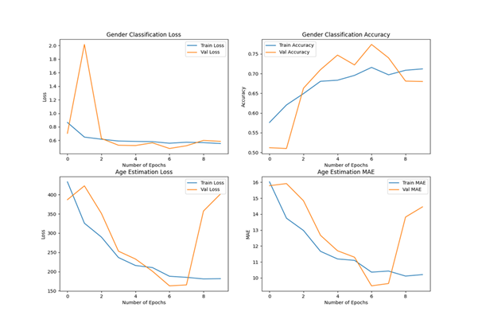
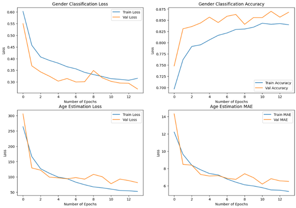
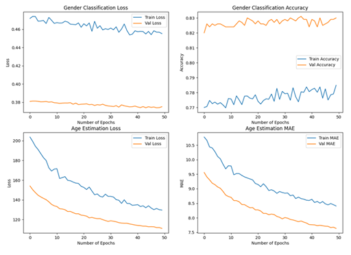

# Facial Analysis: Multi-Task Learning for Age & Gender Prediction
This project explores two distinct Convolutional Neural Network (CNN) approaches to solve a multi-task learning problem: predicting Age (Regression) and Gender (Classification) simultaneously from facial images.

# Project features:

* **Multi-Task Learning:** A single model backbone with dual-head outputs.
* **Architecture Comparison:** Custom-built CNN vs. Fine-tuned MobileNet.
* **Data Augmentation Study:** Comparison between pre-processed custom augmentation and TensorFlow’s real-time ImageDataGenerator pipeline.
* **Optimization:** Implemented Early Stopping, L2 Regularization, and Batch Normalization to manage high-variance facial data.

# Model Architectures:

## Model A: Custom multi-output CNN
Uses 4 blocks of dual Conv2D layers (ReLU) followed by BatchNormalization and MaxPooling2D. Regularization: L2 Kernel Regularization ($\lambda = 0.001$) and Dropout (0.5). Age: 128-neuron Dense layer with a Linear output. Gender: 64-neuron Dense layer with a Sigmoid output.

## Model B: Transfer Learning (MobileNet)
Leveraged a pre-trained MobileNet backbone ($\alpha = 0.75$) to improve feature extraction. Used a frozen base for initial training, followed by unfreezing the last 10 layers for fine-tuning at a very low learning rate (1e-6). Used a Global Average Pooling to reduce feature maps before feeding into task-specific dense layers. Parameters: 2.4 Million with ~570k trainable.

# Results:
The final model A achieved Val MAE of ~6.52 for age and accuracy of ~86.8% for gender,  on the custom set. On the TF set performance was weaker with MAE of ~10.2 for age and accuracy of ~74.0%. The MAE value shows that on average the age predictions were off by about +-6.5 years, or +-10.2 years from the true values. The final model B after fine-tuning achieved Val MAE of ~7.63 for age and accuracy of ~83.0% for gender,  on the custom set. On the TF set performance was stronger with MAE of ~6.64 for age and accuracy of ~86.0%. 

### Model A Learning Curves for custom augmented set
 

### Model A Learning Curves for tensorflow augmented set
 

### Model B Learning Curves for custom augmented set
 

### Model B Learning Curves for tensorflow augmented set
 

# The Impact of Augmentation: 
Custom Pre-Augmentation: Produced smooth, stable learning curves. Because the data was static, the model converged quickly with minimal noise.

TensorFlow (Real-time) Augmentation: Introduced significant "spiky" behavior in the loss graphs. While it caused Model A to underfit, it actually helped Model B (MobileNet) generalize better, achieving its best results on this noisier set. These types of issues may have been caused by limited number of epochs and therefore benefitted from longer training sessions.